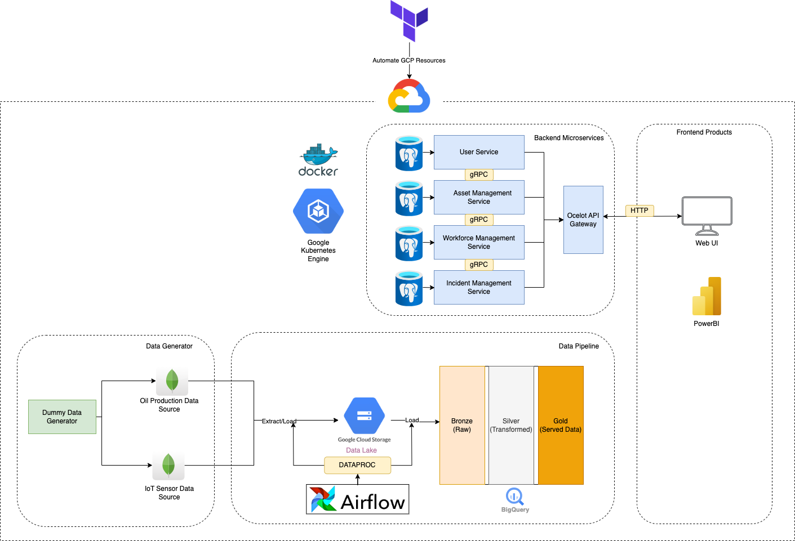

# Purpose of This Project
Exploration and implementation of
1) .NET framework
2) Microservice architecture
3) Data Engineering
4) Cloud services (GCP)
5) Oil and Gas Business Domain (Production)
6) IaC via Terraform
7) Containerization via Docker/K8s

# Project Architecture

# Contributors
1) [Israa Saifullah](https://www.linkedin.com/in/israaibnusaifullah/)
2) [Nazhan Sukri ](https://www.linkedin.com/in/ahmad-nazhan/)

